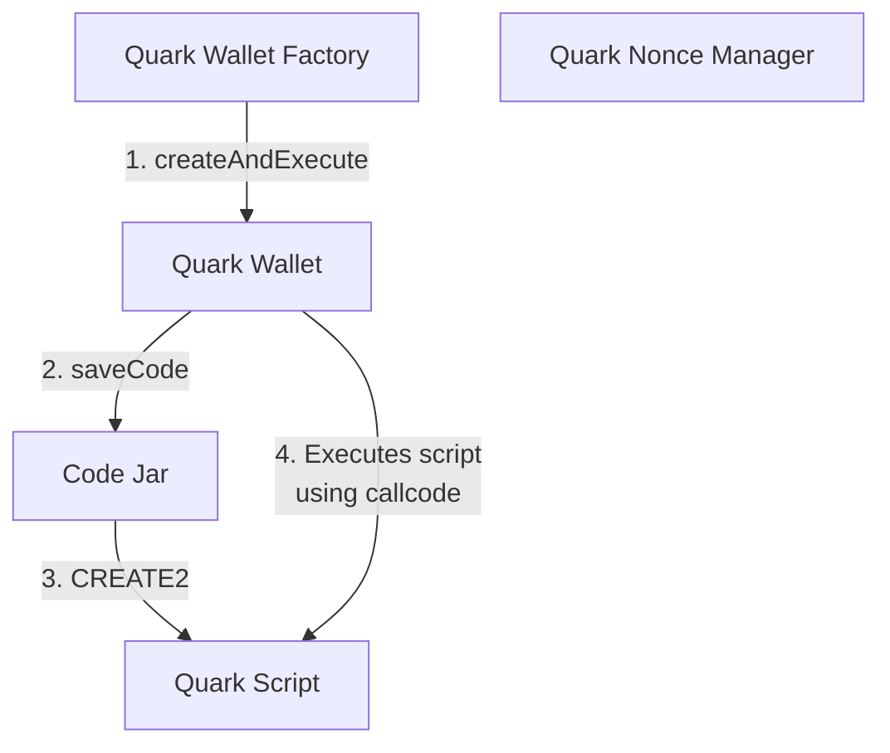

# Quark

## Overview

Quark is an Ethereum smart contract wallet system, designed to run custom code — termed Quark Operations — with each transaction. This functionality is achieved through Quark wallet's capability to execute code from a separate contract via a `callcode` or `delegatecall` operation. The system leverages _Code Jar_, using `CREATE2` to deploy EVM bytecode for efficient code re-use. Additionally, the _Quark Nonce Manager_ contract plays a pivotal role in managing nonces for each wallet operation. The system also includes a wallet factory for deterministic wallet creation and a suite of Core Scripts — audited, versatile contracts that form the foundation for complex Quark Operations such as multicalls and flash-loans.

## Contracts

### Code Jar

_Code Jar_ maps callable contract code to addresses which can then be delegate-called to. Specifically, _Code Jar_ uses `CREATE2` to find or create a contract address whose creation code matches some given input code (EVM opcodes encoded as data). The calling contract (e.g. a wallet) may call _Code Jar_'s `saveCode` function and then run `delegatecall` on the resulting address, which effectively executes arbitrary code.

### Quark Wallet

_Quark Wallet_ is a scriptable wallet located at a counterfactual address derived from an owner EOA. The same EOA will have the same Quark Wallet address across all chains if deployed from the same _Quark Wallet Factory_.

_Quark Wallet_ executes _Quark Operations_ containing a transaction script (or address pointing to a transaction script) and `calldata` representing an encoded function call into that script.

_Quark Operations_ are either directly executed or authorized by signature, and can include replayable transactions and support callbacks for complex operations like flash-loans. See the [Quark Wallet Features](#quark-wallet-features) section for more details.

### Quark Nonce Manager

_Quark Nonce Manager_ is a contract that manages nonces for each Quark wallet and operation, preventing accidental replays of operations. Quark operations can be replayable by generating a secret key and building a hash-chain to allow N replays of a given script.

### Wallet Factory

The _Quark Wallet Factory_ is the central contract for deploying new _Quark Wallets_ at pre-determined addresses. It is generally deployed with peer contracts via _Code Jar_ deployments.

### Quark Script

_Quark Script_ is an extensible contract that exposes helper functions for other Quark scripts to inherit from. The helper functions include those for enabling callbacks, allowing replay of _Quark Operations_, and reading from and writing to a key in the _Quark State Manager_.

### Core Scripts

Core scripts are a set of important scripts that should be deployed via _Code Jar_ to cover essential operations that will likely be used by a large number of _Quark Operations_. Examples of _Core Scripts_ include _Multicall_, _Ethcall_, _Paycall_ and flashloans with callbacks.

## System Diagrams

### Happy path for wallet creation and execution of Quark Operation



## Quark Wallet Features

### Multi Quark Operations

_Multi Quark operations_ are a batch of _Quark operation_ digests signed via a single EIP-712 signature. The _Multi Quark operation_ EIP-712 signature is not scoped to a specific address and chain id, allowing a single signature to flexibly execute operations on multiple _Quark wallets_ owned by the signer on any number of chains. The _Quark operation_ EIP-712 digests in the _Multi Quark operation_ are still scoped to a specific address and chain id, so they are protected against replay attacks.

One common use-case for this feature is cross-chain _Quark operations_. For example, a single signature can be used to 1\) Bridge USDC from mainnet to Base and 2\) Supply USDC to some protocol on Base.

### Separation of Signer and Executor

The `signer` and `executor` roles are separate roles in the _Quark Wallet_. The `signer` is able to sign Quark operations that can be executed by the _Quark Wallet_. The `executor` is able to directly execute scripts on the _Quark Wallet_. Theoretically, the same address can be both the `signer` and `executor` of a _Quark Wallet_. Similarly, the `signer` and/or `executor` can be set to the null (zero) address to effectively remove that role from the wallet.

The separation of these two roles allows for a sub-wallet system, where a wallet can be the `executor` for another wallet but both wallets share the same `signer`. This is discussed in more detail in the [Sub-wallets section](#sub-wallets).

### Sub-wallets

Sub-wallets are _Quark wallets_ controlled by another _Quark wallet_. Specifically, the sub-wallet's `executor` is another _Quark wallet_ (dubbed the "main wallet"), meaning the main wallet can directly execute scripts on the sub-wallet. This allows for complex interactions that span multiple _Quark wallets_ to be executed via a single signature.

For example, let _Wallet A_ be the `executor` of _Wallet B_. Alice is the `signer` for _Wallet A_. If Alice wants to borrow USDC from Comet in _Wallet A_, transfer the USDC to _Wallet B_, and then supply the USDC to Comet from _Wallet B_, she can accomplish this with a single signature of a _Quark operation_. The final action of "supply USDC to Comet in Wallet B" can be invoked by a direct execution call from _Wallet A_.

### Replayable Scripts

Replayable scripts are Quark scripts that can be re-executed N times using the same signature of a _Quark operation_. More specifically, replayable scripts generate a nonce chain where the original signer knows a secret and hashes that secret N times. The signer can reveal a single "submission token" to replay the script which is easily verified on-chain. When the signer reveals the last submission token (the original secret) and submits it on-chain, no more replays are allowed (assuming the secret was chosen as a strong random). The signer can always cancel replays by submitting a nop non-replayable script on-chain or simply forgetting the secret. Note: the chain can be arbitrarily long and does not expend any additional gas on-chain for being longer (except if a script wants to know its position in the chain).

```
Nonce hash chain:

Final replay =        "nonceSecret"
  N-1 replay = hash  ("nonceSecret")
  N-2 replay = hash^2("nonceSecret")
  ...
  First play = hash^n("nonceSecret") = operation.nonce
```

An example use-case for replayable scripts is recurring purchases. If a user wanted to buy X WETH using 1,000 USDC every Wednesday until 10,000 USDC is spent, they can achieve this by signing a single _Quark operation_ of a replayable script ([example](./test/lib/RecurringPurchase.sol)). A submitter can then submit this same signed _Quark operation_ every Wednesday to execute the recurring purchase. The replayable script should have checks to ensure conditions are met before purchasing the WETH.

### Callbacks

Callbacks are an opt-in feature of Quark scripts that allow for an external contract to call into the Quark script (in the context of the _Quark wallet_) during the same transaction. An example use-case of callbacks is Uniswap flashloans ([example script](./quark-core-scripts/src/UniswapFlashLoan.sol)), where the Uniswap pool will call back into the _Quark wallet_ to make sure that the loan is paid off before ending the transaction.

Callbacks need to be explicitly turned on by Quark scripts. Specifically, this is done by writing the callback target address to the callback storage slot in _Quark Nonce Manager_ (can be done via the `allowCallback` helper function in [`QuarkScript.sol`](./quark-core/src/QuarkScript.sol)).

### EIP-1271 Signatures

_Quark wallets_ come with built-in support for EIP-1271 signatures. This means that _Quark wallets_ can be owned by smart contracts. The owner smart contract verifies any signatures signed for the _Quark wallet_, allowing for different types of signature verification schemes to be used (e.g. multisig, passkey).

## Adding Library Dependencies

Dependencies should be added using `forge install` from the root directory. Whenever a new dependency is added, a remapping for it must be defined in both `remappings.txt` and `remappings-relative.txt`. Please see [Project Structure and Sub-projects](#project-structure-and-sub-projects) and [Dependencies](#dependencies).

As of yet, there is no way to automatically keep these in sync. We may explore options for this in the future -- or a linting step that checks for missing remappings.

## Project Structure and Sub-projects

Quark is not quite a typical foundry project. While there is a root `foundry.toml` that combines all the contracts into a single project, related source files are split across sub-directories containing their own, smaller `foundry.toml` projects. We call these "sub-projects." These sub-projects all live in `src`.

You can still `forge build` and `forge test` from the root directory and expect things to work normally. However, sub-projects can also be developed, built, and tested independently. These sub-projects are:

- src/codejar
- src/quark-core
- src/quark-core-scripts
- src/quark-factory
- src/quark-proxy

By separating contracts into these sub-projects, it is possible to use per-project compilation settings to optimize and deploy different sets of contracts with different configurations. Moreover, builds and test runs can be faster for individual sub-projects: from a sub-project directory, `forge build` builds only that sub-project's contracts, and `forge test` runs only the tests that pertain to it. For example:

```sh
# compiles and tests just the quark-core contracts
$ cd quark-core && forge test
```

Sub-projects still share a root-level `lib` and `test` directory, which makes it easier to define the root-level project that compiles and tests the contracts all at once. This also helps to make builds faster: only library contracts actually imported by a sub-project source file are compiled when the sub-project is built, since the `lib` folder is one level above the project root.

Builds are also faster because build caches are separate per-project, so independent builds are more often cached.

Test suites are faster for similar reasons: test suite builds can also utilize isolated per-project caches, and all tests have a shared `test/lib` library one level above the test root, so only testing helper contracts that are actually imported by a test suite will be compiled.

### Dependencies

Please note that project dependencies must be installed in the root directory (not in sub-project directories), and any new entries added to `remappings.txt` must also be added to a `remappings-relative.txt` with a `..` prefix in order for sub-projects to be able to import them.

In other words, if an entry is added to `remappings.txt` like:
```
v3-core=/lib/v3-core
```

Then a corresponding entry must be added to `remappings-relative.txt` so that sub-projects can properly resolve the path:
```
v3-core=../lib/v3-core
```

See [Sub-project Remappings](#sub-project-remappings) for more details.

### Sub-project Remappings

As a consequence of the sub-project structure, source files can no longer use relative imports. Instead, a remapping to each sub-project directory is defined, and all imports are sub-project namespaced, even within the same sub-project: instead of `import "./QuarkWallet.sol";`, it must be written `import "quark-core/src/QuarkWallet.sol";`.

In the root-level `remappings.txt` file, these remappings look ordinary, like `quark-core=./quark-core/`. However, each sub-project needs its own remappings in order to build, and these need to be relative to the root directory even though the project has its own subdirectory; as a result, in each subproject, a `remappings.txt` symlink is created to the `remappings-relative.txt` file in the root directory. This `remappings-relative.txt` file adjusts all of the remappings in the regular root-level `remappings.txt` to be prefixed with a `..` so that they will resolve relative to the root directory, and not the sub-project's directory.

Whenever a new remapping is added to `remappings.txt`, a corresponding entry must be added to `remappings-relative.txt` that prefixes the remapping path with `..` to maintain sub-project compiles; this is covered with an example in the [Dependencies](#dependencies) section.

## Fork tests and NODE_PROVIDER_BYPASS_KEY

Some tests require forking mainnet, e.g. to exercise use-cases like
supplying and borrowing in a comet market.

For a "fork url" we use our rate-limited node provider endpoint at
`https://node-provider.compound.finance/ethereum-mainnet`. Setting up a
fork quickly exceeds the rate limits, so we use a bypass key to allow fork
tests to exceed the rate limits.

A bypass key for Quark development can be found in 1Password as a
credential named "Quark Dev node-provider Bypass Key". The key can then be
set during tests via the environment variable `NODE_PROVIDER_BYPASS_KEY`,
like so:

```
$ NODE_PROVIDER_BYPASS_KEY=... forge test
```

## Updating gas snapshots

In CI we compare gas snapshots against a committed baseline (stored in
`.gas-snapshot`), and the job fails if any diff in the snapshot exceeds a
set threshold from the baseline.

You can accept the diff and update the baseline if the increased gas usage
is intentional. Just run the following command:

```sh
$ NODE_PROVIDER_BYPASS_KEY=... ./script/update-snapshot.sh
```

Then commit the updated snapshot file:

```sh
$ git add .gas-snapshot && git commit -m "commit new baseline gas snapshot"
```

## Deploy

To run the deploy, first, find the _Code Jar_ address, or deploy _Code Jar_ via:

```sh
./script/deploy-code-jar.sh
```

Then deploy Quark via:

```sh
CODE_JAR=... ./script/deploy-quark.sh
```

To actually deploy contracts on-chain, the following env variables need to be set:

```sh
# Required
RPC_URL=
DEPLOYER_PK=
# Optional for verifying deployed contracts
ETHERSCAN_KEY=
CODE_JAR=
```

Once the env variables are defined, run the following command:

```sh
set -a && source .env && ./script/deploy-quark.sh --broadcast
```

## CodeJar Deployments

Using artifacts from [release-v2024-03-27+2249648](https://github.com/compound-finance/quark/releases/tag/release-v2024-03-27%2B2249648).

| Network           | CodeJar Address                            |
| ----------------- | ------------------------------------------ |
| Mainnet           | 0x2b68764bCfE9fCD8d5a30a281F141f69b69Ae3C8 |
| Base              | 0x2b68764bCfE9fCD8d5a30a281F141f69b69Ae3C8 |
| Sepolia           | 0x2b68764bCfE9fCD8d5a30a281F141f69b69Ae3C8 |
| Arbitrum          | 0x2b68764bCfE9fCD8d5a30a281F141f69b69Ae3C8 |
| Optimism          | 0x2b68764bCfE9fCD8d5a30a281F141f69b69Ae3C8 |
| Polygon           | Pending |
| Scroll            | Pending |
| Base Sepolia      | 0x2b68764bCfE9fCD8d5a30a281F141f69b69Ae3C8 |
| Arbitrum Sepolia  | 0x2b68764bCfE9fCD8d5a30a281F141f69b69Ae3C8 |
| Optimism Sepolia  | 0x2b68764bCfE9fCD8d5a30a281F141f69b69Ae3C8 |
