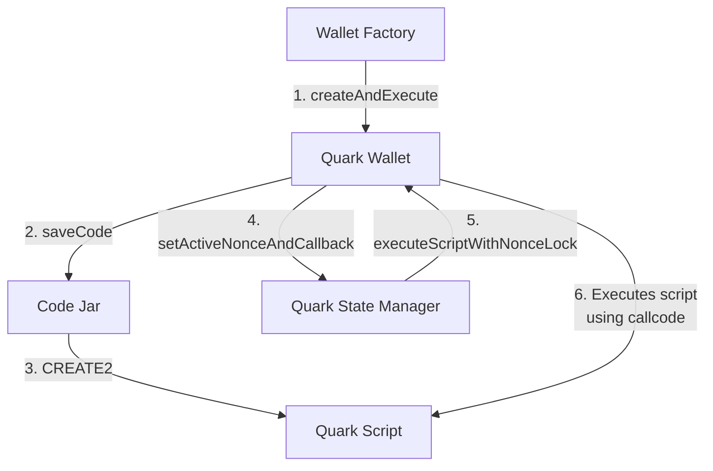

# Quark

## Overview

Quark is an Ethereum smart contract wallet system, designed to run custom code — termed Quark Operations — with each transaction. This functionality is achieved through Quark wallet's capability to execute code from a separate contract via a `callcode` operation. The system leverages Code Jar, using `CREATE2` to deploy bytecode for efficient code reuse. Additionally, the Quark State Manager contract plays a pivotal role in managing nonces and ensuring isolated storage per operation, thus preventing storage conflicts. The system also includes a wallet factory for deterministic wallet creation and a suite of Core Scripts — audited, versatile contracts that form the foundation for complex Quark Operations such as multicalls and flashloans.

## Contracts

### Code Jar

Code Jar maps callable contract code to addresses which can then be delegate-called to. Specifically, Code Jar uses `CREATE2`` to find or create a contract address whose code matches some given input code (EVM opcodes encoded as data). The calling contract (e.g. a wallet) may call Code Jar's saveCode function and then run delegatecall on the resulting address, which effectively executes arbitrary code.

### Quark Wallet

Quark Wallet is a scriptable wallet located at a counterfactual address derived from an owner EOA. The same EOA will have the same Quark Wallet address across all chains if deployed from the same Quark Wallet Factory.

Quark Wallet executes QuarkOperations containing a transaction script (or address pointing to a transaction script) and calldata representing an encoded function call into that script.

QuarkOperations are either directly executed or authorized by signature, and can include replayable transactions and support callbacks for complex operations like flashloans.

### Quark State Manager

Quark State Manager is a contract that manages nonces and ensures isolated storage for each Quark wallet and operation, preventing storage clashes between different wallets and operations.

### Wallet Factory

The Wallet Factory is the central contract for deploying new Quark Wallets at predetermined addresses. It also initializes and deploys other system components, such as Code Jar and Quark State Manager.

### Quark Script
Quark Script is an extensible contract that exposes helper functions for other Quark scripts to inherit from. The helper functions include those for enabling callbacks, allowing replay of QuarkOperations, and reading from and writing to a key in the QuarkStateManager.

### Core Scripts

Core scripts are a set of important scripts that should be deployed via CodeJar to cover essential operations that will likely be used by a large number of QuarkOperations. Examples of Core Scripts include multicall, ethcall, and flashloans with callbacks.

## System Diagrams

### Happy path for wallet creation and execution of Quark Operation



## Fork tests and NODE_PROVIDER_BYPASS_KEY

Some tests require forking mainnet, e.g. to exercise use-cases like
supplying and borrowing in a comet market.

For a "fork url" we use our rate-limited node provider endpoint at
`https://node-provider.compound.finance/ethereum-mainnet`. Setting up a
fork quickly exceeds the rate limits, so we use a bypass key to allow fork
tests to exceed the rate limits.

A bypass key for Quark development can be found in 1Password as a
credential named "Quark Dev node-provider Bypass Key". The key can then be
set during tests via the environment variable `NODE_PROVIDER_BYPASS_KEY`,
like so:

```
$ NODE_PROVIDER_BYPASS_KEY=... forge test
```

## Updating gas snapshots

In CI we compare gas snapshots against a committed baseline (stored in
`.gas-snapshot`), and the job fails if any diff in the snapshot exceeds a
set threshold from the baseline.

You can accept the diff and update the baseline if the increased gas usage
is intentional. Just run the following command:

```sh
$ NODE_PROVIDER_BYPASS_KEY=... forge snapshot
```

Then commit the updated snapshot file:

```sh
$ git add .gas-snapshot && git commit -m "commit new baseline gas snapshot"
```

## Deploy

To locally test run the deploy, run the following command:

```sh
./script/deploy-quark.sh
```

To actually deploy contracts on-chain, the following env variables need to be set:

```sh
# Required
RPC_URL=
DEPLOYER_PK=
# Optional for verifying deployed contracts
ETHERSCAN_KEY=
```

Once the env variables are defined, run the following command:

```sh
set -a && source .env && ./script/deploy-quark.sh --broadcast
```