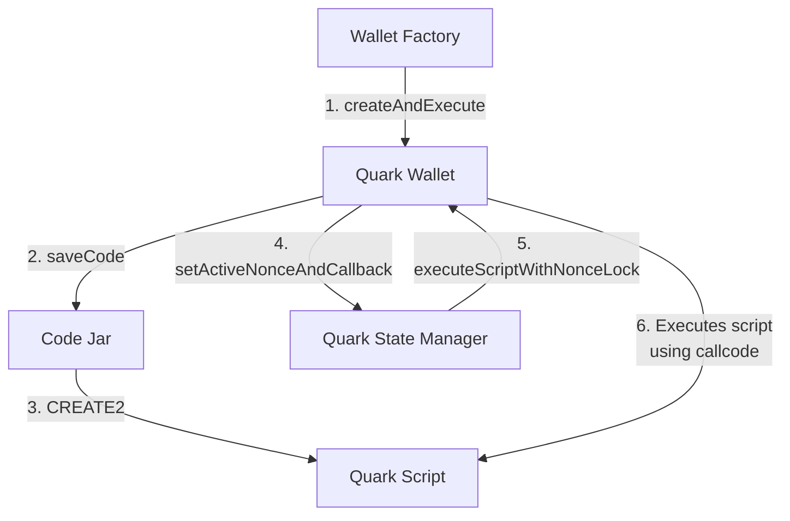

# Quark

## Overview

Quark is an Ethereum smart contract wallet system, designed to run custom code — termed Quark Operations — with each transaction. This functionality is achieved through Quark wallet's capability to execute code from a separate contract via a `callcode` operation. The system leverages Code Jar, using `CREATE2` to deploy bytecode for efficient code reuse. Additionally, the Quark State Manager contract plays a pivotal role in managing nonces and ensuring isolated storage per operation, thus preventing storage conflicts. The system also includes a wallet factory for deterministic wallet creation and a suite of Core Scripts — audited, versatile contracts that form the foundation for complex Quark Operations such as multicalls and flashloans.

## Adding Library Dependencies

Dependencies should be added using `forge install` from the root directory. Whenever a new dependency is added, a remapping for it must be defined in both `remappings.txt` and `remappings-relative.txt`. Please see [Project Structure and Sub-projects](#project-structure-and-sub-projects) and [Dependencies](#dependencies).

As of yet, there is no way to automatically keep these in sync. We may explore options for this in the future -- or a linting step that checks for missing remappings.

## Project Structure and Sub-projects

Quark is not quite a typical foundry project. While there is a root `foundry.toml` that combines all the contracts into a single project, related source files are split across sub-directories containing their own, smaller `foundry.toml` projects. We call these "sub-projects."

You can still `forge build` and `forge test` from the root directory and expect things to work normally. However, sub-projects can also be developed, built, and tested independently. These sub-projects are:

- quark-core
- quark-core-scripts
- terminal-scripts (NOTE that this project will likely be removed into a standalone repo at some point)

By separating contracts into these sub-projects, it is possible to use per-project compilation settings to optimize and deploy different sets of contracts with different configurations. Moreover, builds and test runs can be faster for individual sub-projects: from a sub-project directory, `forge build` builds only that sub-project's contracts, and `forge test` runs only the tests that pertain to it. For example:

```sh
# compiles and tests just the quark-core contracts
$ cd quark-core && forge test
```

Sub-projects still share a root-level `lib` and `test` directory, which makes it easier to define the root-level project that compiles and tests the contracts all at once. This also helps to make builds faster: only library contracts actually imported by a sub-project source file are compiled when the sub-project is built, since the `lib` folder is one level above the project root.

Builds are also faster because build caches are separate per-project, so independent builds are more often cached.

Test suites are faster for similar reasons: test suite builds can also utilize isolated per-project caches, and all tests have a shared `test/lib` library one level above the test root, so only testing helper contracts that are actually imported by a test suite will be compiled.

### Dependencies

Please note that project dependencies must be installed in the root directory (not in sub-project directories), and any new entries added to `remappings.txt` must also be added to a `remappings-relative.txt` with a `..` prefix in order for sub-projects to be able to import them.

In other words, if an entry is added to `remappings.txt` like:
```
v3-core=/lib/v3-core
```

Then a corresponding entry must be added to `remappings-relative.txt` so that sub-projects can properly resolve the path:
```
v3-core=../lib/v3-core
```

See [Sub-project Remappings](#sub-project-remappings) for more details.

### Sub-project Remappings

As a consequence of the sub-project structure, source files can no longer use relative imports. Instead, a remapping to each sub-project directory is defined, and all imports are sub-project namespaced, even within the same sub-project: instead of `import "./QuarkWallet.sol";`, it must be written `import "quark-core/src/QuarkWallet.sol";`.

In the root-level `remappings.txt` file, these remappings look ordinary, like `quark-core=./quark-core/`. However, each sub-project needs its own remappings in order to build, and these need to be relative to the root directory even though the project has its own subdirectory; as a result, in each subproject, a `remappings.txt` symlink is created to the `remappings-relative.txt` file in the root directory. This `remappings-relative.txt` file adjusts all of the remappings in the regular root-level `remappings.txt` to be prefixed with a `..` so that they will resolve relative to the root directory, and not the sub-project's directory.

Whenever a new remapping is added to `remappings.txt`, a corresponding entry must be added to `remappings-relative.txt` that prefixes the remapping path with `..` to maintain sub-project compiles; this is covered with an example in the [Dependencies](#dependencies) section.

## Contracts

### Code Jar

Code Jar maps callable contract code to addresses which can then be delegate-called to. Specifically, Code Jar uses `CREATE2` to find or create a contract address whose code matches some given input code (EVM opcodes encoded as data). The calling contract (e.g. a wallet) may call Code Jar's saveCode function and then run delegatecall on the resulting address, which effectively executes arbitrary code.

### Quark Wallet

Quark Wallet is a scriptable wallet located at a counterfactual address derived from an owner EOA. The same EOA will have the same Quark Wallet address across all chains if deployed from the same Quark Wallet Factory.

Quark Wallet executes QuarkOperations containing a transaction script (or address pointing to a transaction script) and calldata representing an encoded function call into that script.

QuarkOperations are either directly executed or authorized by signature, and can include replayable transactions and support callbacks for complex operations like flashloans.

### Quark State Manager

Quark State Manager is a contract that manages nonces and ensures isolated storage for each Quark wallet and operation, preventing storage clashes between different wallets and operations.

### Wallet Factory

The Wallet Factory is the central contract for deploying new Quark Wallets at predetermined addresses. It also initializes and deploys other system components, such as Code Jar and Quark State Manager.

### Quark Script
Quark Script is an extensible contract that exposes helper functions for other Quark scripts to inherit from. The helper functions include those for enabling callbacks, allowing replay of QuarkOperations, and reading from and writing to a key in the QuarkStateManager.

### Core Scripts

Core scripts are a set of important scripts that should be deployed via CodeJar to cover essential operations that will likely be used by a large number of QuarkOperations. Examples of Core Scripts include multicall, ethcall, and flashloans with callbacks.

## System Diagrams

### Happy path for wallet creation and execution of Quark Operation



## Fork tests and NODE_PROVIDER_BYPASS_KEY

Some tests require forking mainnet, e.g. to exercise use-cases like
supplying and borrowing in a comet market.

For a "fork url" we use our rate-limited node provider endpoint at
`https://node-provider.compound.finance/ethereum-mainnet`. Setting up a
fork quickly exceeds the rate limits, so we use a bypass key to allow fork
tests to exceed the rate limits.

A bypass key for Quark development can be found in 1Password as a
credential named "Quark Dev node-provider Bypass Key". The key can then be
set during tests via the environment variable `NODE_PROVIDER_BYPASS_KEY`,
like so:

```
$ NODE_PROVIDER_BYPASS_KEY=... forge test
```

## Updating gas snapshots

In CI we compare gas snapshots against a committed baseline (stored in
`.gas-snapshot`), and the job fails if any diff in the snapshot exceeds a
set threshold from the baseline.

You can accept the diff and update the baseline if the increased gas usage
is intentional. Just run the following command:

```sh
$ NODE_PROVIDER_BYPASS_KEY=... forge snapshot
```

Then commit the updated snapshot file:

```sh
$ git add .gas-snapshot && git commit -m "commit new baseline gas snapshot"
```

## Deploy

To locally test run the deploy, run the following command:

```sh
./script/deploy-quark.sh
```

To actually deploy contracts on-chain, the following env variables need to be set:

```sh
# Required
RPC_URL=
DEPLOYER_PK=
# Optional for verifying deployed contracts
ETHERSCAN_KEY=
```

Once the env variables are defined, run the following command:

```sh
set -a && source .env && ./script/deploy-quark.sh --broadcast
```
