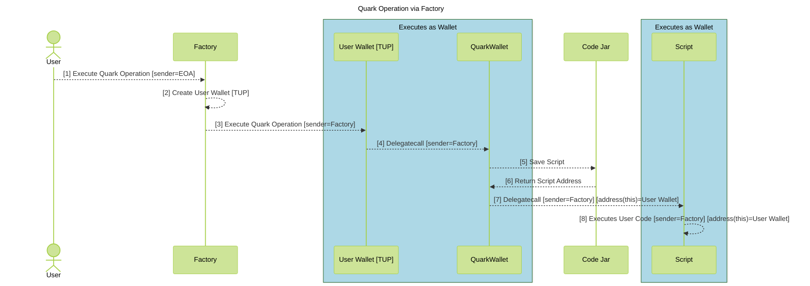
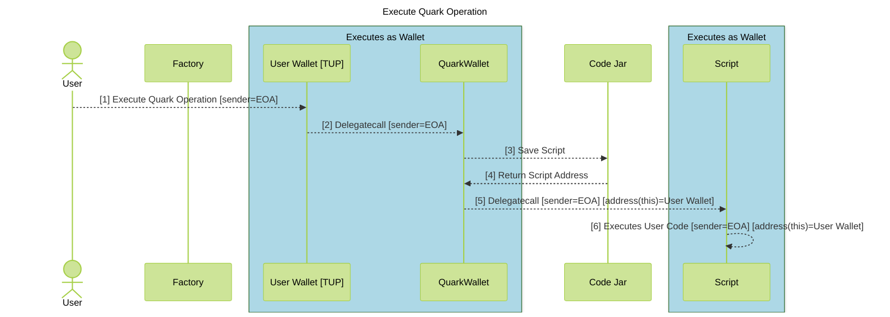
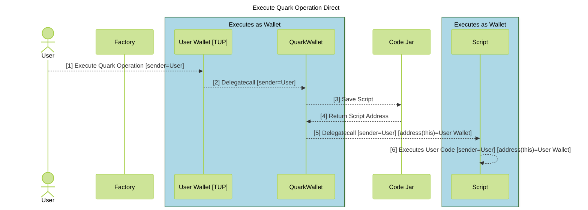
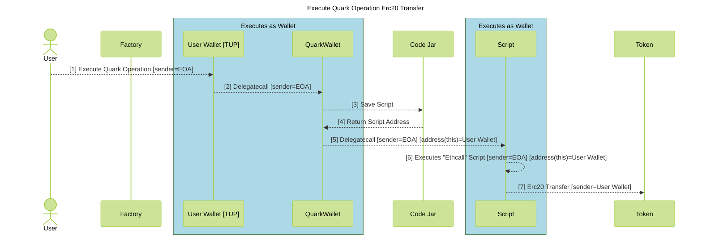
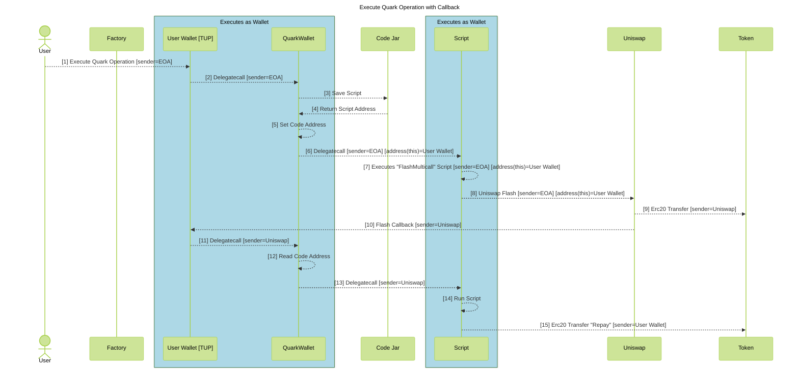

## Quark Operation via Factory

```mermaid
sequenceDiagram title: Quark Operation via Factory
    %%{init: {'theme': 'forest' } }%%
    actor User
    participant F as Factory

    box lightblue Executes as Wallet
    participant UW as User Wallet [TUP]
    participant QW as QuarkWallet
    end
    participant CJ as Code Jar
    box lightblue Executes as Wallet
    participant S as Script
    end

    User -->> F: [1] Execute Quark Operation [sender=EOA]
    F -->> F: [2] Create User Wallet [TUP]
    F -->> UW: [3] Execute Quark Operation [sender=Factory]
    UW -->> QW: [4] Delegatecall [sender=Factory]
    QW -->> CJ: [5] Save Script
    CJ -->> QW: [6] Return Script Address
    QW -->> S: [7] Delegatecall [sender=Factory] [address(this)=User Wallet]
    S -->> S: [8] Executes User Code [sender=Factory] [address(this)=User Wallet]
```

## Execute Quark Operation

```mermaid
sequenceDiagram title: Execute Quark Operation
    %%{init: {'theme': 'forest' } }%%
    actor User
    participant F as Factory

    box lightblue Executes as Wallet
    participant UW as User Wallet [TUP]
    participant QW as QuarkWallet
    end
    participant CJ as Code Jar
    box lightblue Executes as Wallet
    participant S as Script
    end

    User -->> UW: [1] Execute Quark Operation [sender=EOA]
    UW -->> QW: [2] Delegatecall [sender=EOA]
    QW -->> CJ: [3] Save Script
    CJ -->> QW: [4] Return Script Address
    QW -->> S: [5] Delegatecall [sender=EOA] [address(this)=User Wallet]
    S -->> S: [6] Executes User Code [sender=EOA] [address(this)=User Wallet]
```

## Execute Quark Operation Direct

```mermaid
sequenceDiagram title: Execute Quark Operation Direct
    %%{init: {'theme': 'forest' } }%%
    actor User
    participant F as Factory

    box lightblue Executes as Wallet
    participant UW as User Wallet [TUP]
    participant QW as QuarkWallet
    end
    participant CJ as Code Jar
    box lightblue Executes as Wallet
    participant S as Script
    end

    User -->> UW: [1] Execute Quark Operation [sender=User]
    UW -->> QW: [2] Delegatecall [sender=User]
    QW -->> CJ: [3] Save Script
    CJ -->> QW: [4] Return Script Address
    QW -->> S: [5] Delegatecall [sender=User] [address(this)=User Wallet]
    S -->> S: [6] Executes User Code [sender=User] [address(this)=User Wallet]
```

## Execute Quark Operation Erc20 Transfer

```mermaid
sequenceDiagram title: Execute Quark Operation Erc20 Transfer
    %%{init: {'theme': 'forest' } }%%
    actor User
    participant F as Factory

    box lightblue Executes as Wallet
    participant UW as User Wallet [TUP]
    participant QW as QuarkWallet
    end
    participant CJ as Code Jar
    box lightblue Executes as Wallet
    participant S as Script
    end
    participant T as Token

    User -->> UW: [1] Execute Quark Operation [sender=EOA]
    UW -->> QW: [2] Delegatecall [sender=EOA]
    QW -->> CJ: [3] Save Script
    CJ -->> QW: [4] Return Script Address
    QW -->> S: [5] Delegatecall [sender=EOA] [address(this)=User Wallet]
    S -->> S: [6] Executes "Ethcall" Script [sender=EOA] [address(this)=User Wallet]
    S -->> T: [7] Erc20 Transfer [sender=User Wallet]
```

## Execute Quark Operation with Callback

```mermaid
sequenceDiagram title: Execute Quark Operation with Callback
    %%{init: {'theme': 'forest' } }%%
    actor User
    participant F as Factory

    box lightblue Executes as Wallet
    participant UW as User Wallet [TUP]
    participant QW as QuarkWallet
    end
    participant CJ as Code Jar
    box lightblue Executes as Wallet
    participant S as Script
    end
    participant U as Uniswap
    participant T as Token

    User -->> UW: [1] Execute Quark Operation [sender=EOA]
    UW -->> QW: [2] Delegatecall [sender=EOA]
    QW -->> CJ: [3] Save Script
    CJ -->> QW: [4] Return Script Address
    QW -->> QW: [5] Set Code Address
    QW -->> S: [6] Delegatecall [sender=EOA] [address(this)=User Wallet]
    S -->> S: [7] Executes "FlashMulticall" Script [sender=EOA] [address(this)=User Wallet]
    S -->> U: [8] Uniswap Flash [sender=EOA] [address(this)=User Wallet]
    U -->> T: [9] Erc20 Transfer [sender=Uniswap]
    U -->> UW: [10] Flash Callback [sender=Uniswap]
    UW -->> QW: [11] Delegatecall [sender=Uniswap]
    QW -->> QW: [12] Read Code Address
    QW -->> S: [13] Delegatecall [sender=Uniswap]
    S -->> S: [14] Run Script
    S -->> T: [15] Erc20 Transfer "Repay" [sender=User Wallet]
```
